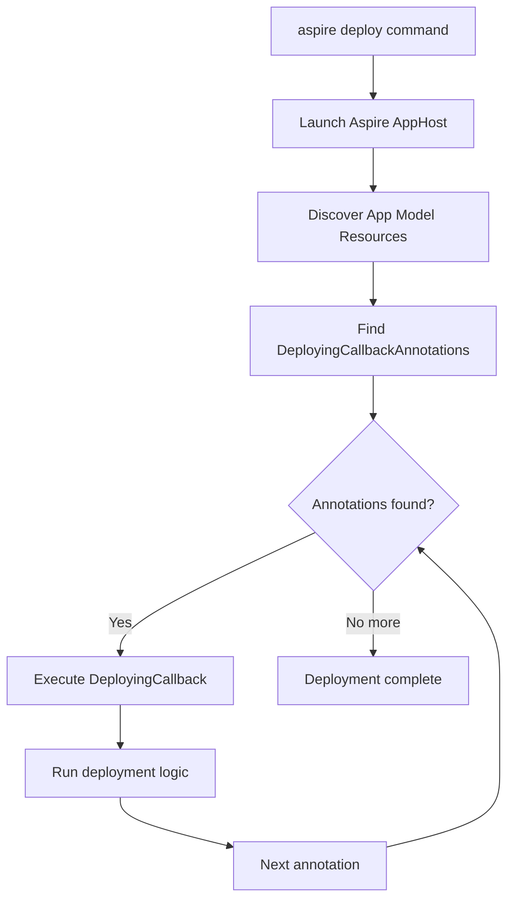

OK, sit down folks, because this one is gonna be a long one. This is the all-encompassing blog post about the thing I've been working on for the past few weeks: Aspire Pipelines. I've been writing about specific aspects of this feature over the past few weeks, including [my post from a while back about "modes" in Aspire](_posts/2025/2025-10-06-aspire-publish-vs-deploy.md) and [last week's post about the CLI redesign](_posts/2025/2025-10-27-aspire-deploy-cli-ux.md) for Aspire. Today, I want to talk about how the feature evolved from its initial inception, take a look at specific implementation details and how they changed, cover the feature in its current state, and talk a little bit about what's next for this area.

Let's get started by establishing some context. If you're not familiar with it, [Aspire](https://aspire.dev) is a framework for modeling cloud-based applications in code, running them locally, and deploying them. The bulk of this blog post is about the last point: the messy work of deploying applications to the cloud. When you deploy an application to the cloud, there's a ton of stuff that needs to happen: build container images, provision databases, set up networking, assigning permissions, scanning assets for secrets, applying data migrations as needed, and on and on and on. Some of these tasks can happen at the same time on the same machine, some of it can't. Some of it is easy to automate and some of it is not. Managing and _modeling_ all that orchestration is messy, and that's the problem we've been trying to tackle.

To not overwhelm ourselves (or let's be real, overwhelm me), let's hone in on a very specific and simple scenario. Let's say you're deploying a typical web app: a frontend, an API service, a database, and some blob storage. Let's simplify things further by saying that you are deploying it for the first time, there's no databases already provisioned with data so we don't need to worry about migrations or any of that. A simple case. I have an app on my computer, I need to deploy it to the web. What do? Let's talk about how we tackled this problem by discussing the first inception of deployment support in Aspire, which came about in the 9.4 release.

### The Beginning: Aspire 9.4 and Basic Callbacks

If you're not familiar with Aspire, let's cover some of the key technical aspects that will help clarify some of the groundwork that was laid out in this release. Aspire lets you model your application services in a code-based application host. This file defines the compute resources and infrastructure resources that exist in your application. For the typical web app we are working with, the AppHost might be implemented as follows.

```csharp
var builder = DistributedApplication.CreateBuilder(args);

builder.AddAzureContainerAppsEnvironment("env");

var storage = builder.AddAzureStorage("myapp-storage");
var database = builder.AddPostgres("myapp-db");

var api = builder.AddCSharpApp("api", "./api.cs")
    .WithHttpEndpoint()
    .WithReference(storage)
    .WithReference(database);

builder.AddViteApp("frontend", "./frontend")
    .WithReference(api);

builder.Build().Run();
```

Each of the components described in the AppHost is considered a resource in the Aspire resource model (think: all the databases, services, and infrastructure your app needs). The AppHost could interact with a number of entities. One of those entities is the Aspire CLI which communicates with the AppHost over RPC to do things like execute the AppHost and start up local orchestration or query specific APIs within the AppHost to generate assets or get a sense of application state.

Hopefully, that is enough context to describe the key components that were introduced with relation to deployment in 9.4. Those core components included:

- An `aspire deploy` command in the Aspire CLI that served as the entrypoint for the core deployment functionality
- A `DeployingCallbackAnnotation` that could be registered in the Aspire resource model. This annotation contained...
- A `DeployingCallback` which encompassed arbitrary behavior that should be triggered during deploy

Here's what the AppHost above would look like with a simple `DeployingCallbackAnnotation` that defined the behavior of the AzureContainerAppsEnvironment that was declared.

```csharp
var builder = DistributedApplication.CreateBuilder(args);

builder.AddAzureContainerAppsEnvironment("env")
    .WithAnnotation(new DeployingCallbackAnnotation(async (context) =>
    {
        // Some code to deploy to ACA here
    }));

var storage = builder.AddAzureStorage("myapp-storage");
var database = builder.AddPostgres("myapp-db");

var api = builder.AddCSharpApp("api", "./api.cs")
    .WithHttpEndpoint()
    .WithReference(storage)
    .WithReference(database);

builder.AddViteApp("frontend", "./frontend")
    .WithReference(api);

builder.Build().Run();
```

The initial design used callbacks to maintain maximal flexibility. We didn't want to lock users into a specific deployment target or opinionated workflow. With callbacks, you could write code to deploy to AWS, push to a custom container registry, run database migrations, or really anything else. The callback was just a function: you had complete control over what happened inside it. While other aspects of the design have evolved, the notion of enacpsulating the actual core logic in a callback hasn't changed.

The annotation pattern itself is worth calling out because it shows up throughout Aspire. Resources in the application model are just state, so behaviors are attached via annotations rather than by modifying the resource directly. Annotations essentially allow us to decorate resources with extra metadata about how they should behave in different scenarios. Annotations are used to describe what endpoints a resource exposes or what environment variables should be injected into the process associated with a resource.

As mentioned earlier, the CLI serves as a thin client that coordinates with the Aspire application host, which contains the actual state associated with the running application. Here's how the pieces fit together when you run `aspire deploy`:



In addition to these core APIs, Aspire 9.4 also brought about the introduction of the `PublishingActivityReporter`: an API surface area that allowed the AppHost (basically, the code where you define your application and its dependencies) to communicate to a client (in this case, the CLI) the progress of various activities that were ongoing in the deployment. I blogged more about this particularly API and the way it evolved in [last week's blog post](/_posts/2025/2025-10-27-aspire-deploy-cli-ux.md). The `PublishingActivityReporter` also provided APIs that allowed the AppHost to send requests to prompt the user for values in the CLI. This functionality built on the same central APIs that were used to support prompting for values in the web-based Aspire dashboard.

All these building blocks allowed the user to register code in the AppHost that would define what the deployment behavior would be. When the `aspire deploy` command was called, it would query the AppHost and initiate the invocation of all `DeployingCallbackAnnotation`s that existed in the application model. Inside this code, you could prompt the user for values as the deployment was ongoing and present notifications about the progress of the deployment to the users.

So, at this point in time, we had:

- A command in the CLI client that served as the entry point for executing a deployment
- Infrastructure in the AppHost that would discover user-specified deployment code and execute it when the entrypoint was invoked
- A way to notify the client of progress on the deployment

These core components were useful enough to implement some interesting things. A couple of weeks back I posted about using [these initial deployment APIs to deploy a static site with Azure Front Door](_posts/2025/2025-09-07-aspire-deploy.md).

Here's what was missing at this point though: there was no orchestration of callback execution order, no dependency management between callbacks, and no built-in error handling or retry logic. If you had multiple callbacks, they ran sequentially in the order they were registered. If one failed, there was no rollback or recovery. If you wanted to deploy to Azure at this point, you'd have to write all the provisioning logic yourself, coordinate the order of operations manually, and handle all the error cases. That's a lot of work for what should be a common scenario. Don't worry though, we fixed that in the next release and had the opportunity to put the APIs that would theoretically work in practice in a big way.

### Getting Real: Aspire 9.5 and Azure Deployment

That big way came about in Aspire 9.5, when we introduced built-in support for deploying to Azure with the `aspire deploy` command. Instead of users having to write all the provisioning logic themselves like they would have in 9.4, we now provided it out of the box. The implementation was modeled under a single code entry-point that would then execute the process of completing the deployment in four distinct steps:

1. It would acquire the configuration details associated with the Azure subscription and resource group that the user intended to deploy to. If it didn't find any configuration details saved from the typical configuration sources (user secrets, environment variables, or configuration files), it would prompt the user for them using the `PublishingActivityReporter` APIs from 9.4. This is where that interactive communication channel between the AppHost and CLI really paid off. Users could get prompted during the deployment for any missing values without having to restart the whole process and update configuration sources with their values.
2. It would provision the infrastructure resources in the application model. Infrastructure resources consist of things like databases, storage accounts, and container registries that are distinct from compute resources. This is where we would map Aspire's resource abstractions (like `AddAzureRedis()` or `AddCosmosDB()`) to actual Azure services. We also provision managed identities and role assignments here to handle authentication between services.
3. It would build container images for any compute resources defined in the app. If you're running Docker or Podman locally, we use your container runtime to do the builds. If you're deploying a .NET project, we use .NET's built-in container build support (which doesn't require Docker at all for builds). Once built, we tag and push these images to Azure Container Registry (ACR) that was provisioned in the previous step.
4. It would deploy the compute resources using the images built in step 3 and the infrastructure allocated in step 2. At this point, we were primarily targeting Azure Container Apps (ACA) as the compute platform, though the design allowed for other targets in the future.

And voilà! You have a deployed application with all its infrastructure dependencies. It's important to call out that while I used the terms "steps" above, none of these behaviors were modeled that way in the application code. The code for this essentially looked like:

```csharp
public async Task DeployAsync(DeployingContext context)
{
  await GetProvisioningOptions();
  await ProvisionInfrastructureResources();
  await BuildComputeImages();
  await DeployComputeImages();
}
```

In addition to there being no distinct concept of steps, there's also no clear concept of dependencies. The fact that things are called in the order that they are is a result of the invocation order in the application code. One of the key things we played around with at this point in time was the level of granularity we utilized as far as what deployments we sent over to Azure for a given application. Granularity of deployments is a key concept that we'll keep referring to in this blog, but let's hone in on this particular question

These details are specific to Azure but they apply to other deployment engines as well. When we ask Azure to provision resources in the cloud, we can send a request to provision _all_ of the resources that are registered in the application model at once. This leaves it up to Azure to identify the best granularity and concurrency for the deployment on its end. The big pro here is that Azure can potentially optimize the deployment internally and cache state across the entire operation. The downside, however, is that when things fail, our client gets a top-level failure that encapsulates all the resources instead of knowing exactly which specific resource caused the problem.

We landed in a model where we request Azure to provision each resource individually: one call for CosmosDB, another for Azure Storage, another for the Azure Container Registry. This gives us the ability to provide more granular error reporting on the client side (you know exactly that CosmosDB provisioning failed, not just "something went wrong"), but we lose the ability to leverage Azure's state caching optimizations. It's a tradeoff between visibility and performance that we made in the initial design. State caching is an important thing to call out here. We don't do any state caching by default, but let's put a pin on this and we'll revisit it later.

In the code above, you'll observe that each chunky step in the execution is its own function and we would await the first before continuing with the second. That means if provisioning CosmosDB takes 3 minutes and provisioning Storage takes 2 minutes, we're waiting a full 5 minutes total, even though they could theoretically execute in parallel. Any dependencies that just needed CosmosDB would have to wait even though they could start much sooner. Same with building container images: if you have multiple services, we build them one at a time. This sequential execution was a significant bottleneck and it was visible to users. The deployment experience just wasn't as snappy as it should be.

We put a pin on state caching for provisioned resources, but this gap also applies to parameters that are required during the deployment process. It was great that you were prompted for missing values every time you tried to deploy, but we never saved those values anywhere. That means _every time_ you deployed you would be prompted for values. Needless to say, I got some complaints thrown my way for this.

The main progress made in this release was identifying the quirks involved that were specific to deploying to Azure and identifying where the gaps were. In the next iteration of Aspire (versioned as 13 for reasons I won't get into) many of the problems we've been discussing around granularity, state persistence, and concurrency become resolved.

> I should clarify that the choice to target Azure isn't because Aspire only supports Azure, it's just a side-effect of working at the Blue Sky company.

### The Pipeline Emerges: Aspire 13

One of the biggest problems we sought to address in the next release is the sequential nature of the execution model in the deployment framework. This changes with the introduction of a `DistributedApplicationPipeline` in Aspire 13. The pipeline consists of a set of `PipelineStep`s which define concrete behavior associated with a particular named action. Now, instead of defining each of the pieces of functionality above as functions in code, we can describe them as steps in the pipeline.

```csharp
public IDistributedApplicationPipeline Task DeployAsync(IDistributedApplicationPipeline pipeline)
{
    pipeline.AddStep("get-provisioning-options", (context) => await GetProvisioningOptions());
    pipeline.AddStep("provision-infra", (context) => await ProvisionInfrastructureResources());
    pipeline.AddStep("build-images", (context) => await BuildComputeImages());
    pipeline.AddStep("deploy-compute", (context) => await DeployComputeImages());
    return pipeline;
}
```

When the Aspire application boots up in pipeline execution mode (side note: "this isn't a real mode", for more on that, read [this blog post](_posts/2025/2025-09-15-aspire-modes.md)), it resolves all of the steps in the pipeline and their dependent steps then executes them. In addition to being registered directly on the pipeline, steps can also be registered on resources within the application model using the annotations we referenced above. That means a resource modeled within Aspire can describe what it is _and_ how it behaves in the pipeline. The resolution step discovers steps that are defined both directly on the pipeline and those that exist on resources in the application model. The pipeline that is executed is the joined set of those two.

One of the things that evolved with the implementation of pipeline is the level of granularity of steps. Earlier we mentioned granularity when it comes to the provisioning of infrastructure resources and covered the pros/cons specific to the deployment of these assets. However, we can take granularity further for other aspects of the deployment pipeline: like the building of images and deploying of compute resources. This allows us to model maximal concurrency across the pipeline. If you read my [last blog post](_posts/2025/2025-10-27-aspire-deploy-cli-ux.md) on the UI work involved to visualize this concurrency in the CLI, this behavior is essentially the "backend" of that implementation. Here's a visual for what a complete and concurrent pipeline to support deploying our example app with a frontend, API service, a CosmosDB database, and Azure Storage might look like.

```mermaid
graph TD
    %% Level 0 - Prerequisites (parallel)
    BP[build-prereq]
    DP[deploy-prereq]

    %% Level 1 - Build and Validation (parallel)
    BA[build-apiservice]
    BW[build-webfrontend]
    VAL[validate-azure-login]
    
    %% Level 2 - Provisioning Context
    CPC[create-provisioning-context]
    
    %% Level 3 - Resource Provisioning (parallel)
    PAE[provision-aca-env]
    PAI[provision-apiservice-identity]
    PARC[provision-apiservice-roles-cosmosdb]
    PARS[provision-apiservice-roles-storage]
    PC[provision-cosmosdb]
    PS[provision-storage]
    
    %% Level 4 - ACR Login
    LAC[login-to-acr-aca-env]
    
    %% Level 5 - Push Images (parallel)
    PUA[push-apiservice]
    PUW[push-webfrontend]
    
    %% Level 6 - Provision Container Apps (parallel)
    PACA[provision-apiservice-containerapp]
    PWCA[provision-webfrontend-containerapp]
    
    %% Level 7 - Bicep and Summaries (parallel)
    PAS[print-apiservice-summary]
    PWS[print-webfrontend-summary]
    PABR[provision-azure-bicep-resources]
    
    %% Level 8 - Dashboard URL
    PDU[print-dashboard-url-aca-env]
    
    %% Level 9 - Deploy Target
    DEPLOY[deploy]
    
    %% Dependencies - Level 0 to 1
    BP --> BA
    BP --> BW
    DP --> BA
    DP --> BW
    DP --> VAL
    
    %% Dependencies - Level 1 to 2
    VAL --> CPC
    DP --> CPC
    
    %% Dependencies - Level 2 to 3
    CPC --> PAE
    CPC --> PAI
    CPC --> PARC
    CPC --> PARS
    CPC --> PC
    CPC --> PS
    
    %% Dependencies - Level 3 to 4
    PAE --> LAC
    
    %% Dependencies - Level 4 to 5
    LAC --> PUA
    LAC --> PUW
    BA --> PUA
    BW --> PUW
    PAE --> PUA
    PAE --> PUW
    
    %% Dependencies - Level 5 to 6
    PUA --> PACA
    PUW --> PWCA
    CPC --> PACA
    CPC --> PWCA
    
    %% Dependencies - Level 6 to 7
    PACA --> PAS
    PWCA --> PWS
    PACA --> PABR
    PWCA --> PABR
    PAE --> PABR
    PAI --> PABR
    PARC --> PABR
    PARS --> PABR
    PC --> PABR
    PS --> PABR
    DP --> PABR
    CPC --> PABR
    
    %% Dependencies - Level 7 to 8
    PAE --> PDU
    PABR --> PDU
    
    %% Dependencies - Level 8 to 9 (deploy target)
    BA --> DEPLOY
    BW --> DEPLOY
    CPC --> DEPLOY
    PAS --> DEPLOY
    PDU --> DEPLOY
    PWS --> DEPLOY
    PABR --> DEPLOY
    VAL --> DEPLOY
    
    %% Styling
    style DEPLOY fill:#E74C3C,stroke:#A93226,stroke-width:3px,color:#fff
    style BP fill:#95A5A6,stroke:#7F8C8D,stroke-width:2px,color:#fff
    style DP fill:#95A5A6,stroke:#7F8C8D,stroke-width:2px,color:#fff
    style BA fill:#3498DB,stroke:#2874A6,stroke-width:2px,color:#fff
    style BW fill:#3498DB,stroke:#2874A6,stroke-width:2px,color:#fff
    style VAL fill:#F39C12,stroke:#CA6F1E,stroke-width:2px,color:#fff
    style CPC fill:#9B59B6,stroke:#6C3483,stroke-width:2px,color:#fff
    style PAE fill:#16A085,stroke:#117A65,stroke-width:2px,color:#fff
    style PAI fill:#16A085,stroke:#117A65,stroke-width:2px,color:#fff
    style PARC fill:#16A085,stroke:#117A65,stroke-width:2px,color:#fff
    style PARS fill:#16A085,stroke:#117A65,stroke-width:2px,color:#fff
    style PC fill:#16A085,stroke:#117A65,stroke-width:2px,color:#fff
    style PS fill:#16A085,stroke:#117A65,stroke-width:2px,color:#fff
    style LAC fill:#E67E22,stroke:#A04000,stroke-width:2px,color:#fff
    style PUA fill:#2ECC71,stroke:#229954,stroke-width:2px,color:#fff
    style PUW fill:#2ECC71,stroke:#229954,stroke-width:2px,color:#fff
    style PACA fill:#16A085,stroke:#117A65,stroke-width:2px,color:#fff
    style PWCA fill:#16A085,stroke:#117A65,stroke-width:2px,color:#fff
    style PAS fill:#F1C40F,stroke:#B7950B,stroke-width:2px,color:#000
    style PWS fill:#F1C40F,stroke:#B7950B,stroke-width:2px,color:#000
    style PABR fill:#16A085,stroke:#117A65,stroke-width:2px,color:#fff
    style PDU fill:#F1C40F,stroke:#B7950B,stroke-width:2px,color:#000
```



Yeah, that's a lot. The key things to note are in the colors. All the provisioning steps (in teal) can run at the same time. The two build steps (in blue) kick off in parallel as well. As soon as we are done building our images and as soon as the container registry is provisioned, we can push the images that we built to the remote registry. We're not sitting around waiting for any unnecessary steps to complete.

This is a good segway into the other aspect of this feature: the ability to wire up dependencies between steps in the pipeline. In the case above, the top-level "provision-resources" has dependencies on the provisioning steps associated with each individual resource. Dependencies can be attached across any step in the pipeline. From the diagram, you can also see that there's levels to this. (Sorry, I couldn't resist.) The levels map closely to the the code sample that we looked at earlier. One level captures the set of steps related to building compute images, another for pushing container images (in light green), and a third for deploying both compute resources and infrastructure resources.

The granularity of the pipeline allows us to create relationships between individual components within the resource model. For example, as soon as the container image for the API backend is built, we can push the image to the remote registry. That step has a dependency on the compute environment being provisioned (it hosts the image registry), but as soon as that is done we can deploy the compute resource. Links across granular steps exist across the levels (or meta-steps as they are modeled in the API) that they are parented to.

One of the other things that changed in Aspire 13 is the introduction of deployment state caching in the API. I shared more detail about this in [one of my previous blog posts](_posts/2025/2025-10-20-aspire-deployment-state.md). This change allowed us to save the values of parameters that we prompted for _and_ the provisioned cloud resources in a file on disk. Multiple calls to `aspire deploy` can reuse the state that is saved. Since we've mentioned the `aspire deploy` command again, let's talk about how the CLI for this experience evolved in this release. As part of leaning in towards this pipeline thing, Aspire 13 also includes support for a new `aspire do` command that allows you to execute arbitrary steps that are modeled in your AppHost. It works pretty similarly to the `aspire deploy` command that's modeled in the diagram above, except instead of finding and discovering `DeployingCallback` annotations the CLI finds and executes `PipelineStep`s in the implementation.

## Fin

If you've got experience with this area, you might've realized that we've essentially exposed a way to model build and deployment pipelines within Aspire. And that's exactly it. If you've used GitHub Actions or Jenkins, you've seen pipelines with steps and dependencies. There's also many pipelines-in-code implementations in various ecosystems in the form of build automation tools ([Cake](https://github.com/cake-build/cake) in C#, [Rake](https://github.com/ruby/rake) in Ruby, [doit](https://pydoit.org) in Python). Same idea, but this one runs inside your application code and knows about your app's resources in real-time. The crux of the magic is the combination of data in the DistributedApplicationModel and execution in the DistributedApplicationPipeline joined together to allow you to declare code that is not only debuggable, but aware in real-time of the state of your application. And that's the magic trick here: it knows what your app looks like and can make smart decisions based on that.

As you might imagine, this is just the beginning of this new Aspire Pipelines story. There's a lot of loose threads to tie up and ideas to pursue.

- Earlier in this post, I mentioned concepts around resiliency and retries for deployment steps. This is not yet in place but we've laid enough infrastructure to bring this in.
- The current iteration of the deployment state management APIs is a little rough and is definitely due for a revamp in future releases.
- There's a future for enhancing the pipeline steps API to make it easier to model certain types of steps: for example, steps that involve calling into an external process or steps that involve interacting with a container runtime.

There's more to add to this list as more folks build on top of these primitives. I'm excited to see how this space evolves once this feature actually launches in Aspire 13 (check out the [Aspire site](https://aspire.dev/) for more details). Until next time, happy deploying!
